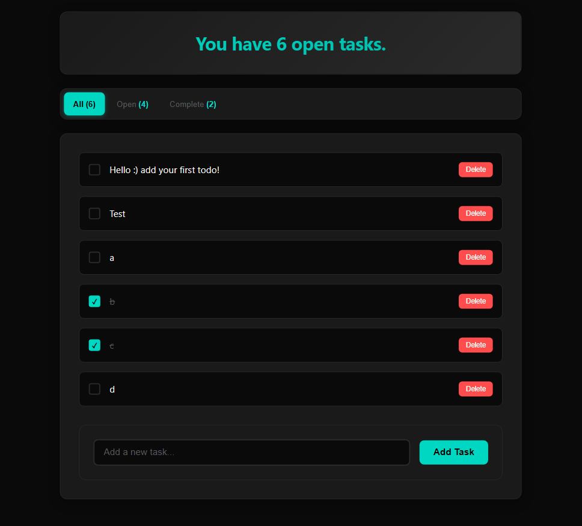
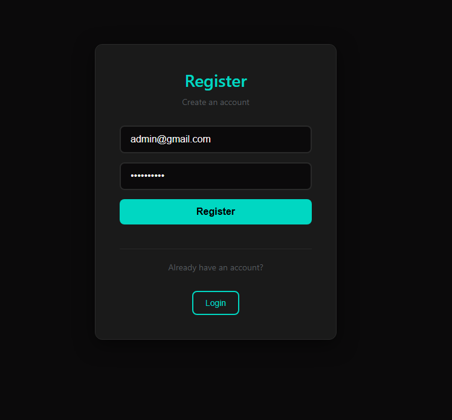
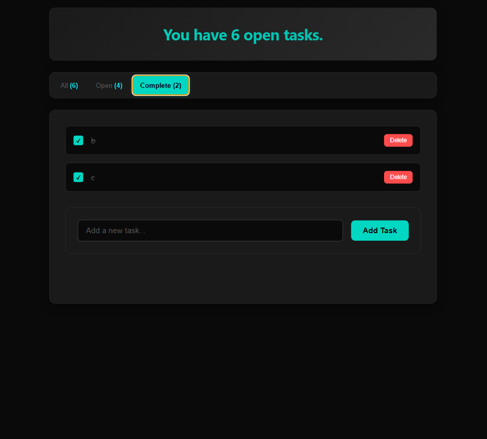

# Todo App - Node.js, Express.js & SQLite

A full-stack todo application built with Node.js, Express.js, SQLite and JWT for authentication.



## 🚀 Features

- **User Authentication**: Secure registration and login with JWT tokens
- **Task Management**: Create, read, update, and delete todos
- **Task States**: Mark tasks as complete or incomplete
- **Real-time Updates**: Dynamic UI updates without page refreshes
- **Security**: Password hashing with bcrypt and JWT token validation

## 📸 Screenshots

| Login/Register | Main Dashboard | Completed Tasks |
|---------------|----------------|-----------------|
|  |  |  |

## 🛠️ Technologies Used

### Backend
- **Node.js** - JavaScript runtime environment
- **Express.js** - Web application framework
- **SQLite** - Lightweight, serverless database
- **JSON Web Tokens (JWT)** - Secure authentication
- **bcryptjs** - Password hashing

### Frontend
- **Vanilla JavaScript** - Client-side interactivity
- **HTML** - Semantic markup
- **CSS** - Modern styling with custom properties and flexbox
- **REST API** - Communication between frontend and backend

## 📋 Prerequisites

Before running this application, make sure you have the following installed:
- [Node.js](https://nodejs.org/) (version 14 or higher)
- npm (comes with Node.js)

## 🔧 Installation & Setup

1. **Clone the repository**
   ```bash
   git clone <your-repository-url>
   cd "Todo App-NodeJS_ExpressJS_SQLite"
   ```

2. **Install dependencies**
   ```bash
   npm install
   ```

3. **Create environment file**
   Create a `.env` file in the root directory and add your JWT secret:
   ```env
   JWT_SECRET=your_secret_jwt_key_here
   PORT=3000 (or whatever port you prefer)
   ```

4. **Start the application**
   ```bash
   npm start
   ```

5. **Access the application**
   Open your browser and navigate to `http://localhost:PORT`

## 📁 Project Structure

```
Todo App-NodeJS_ExpressJS_SQLite/
├── public/                 # Frontend files
│   ├── index.html         # Main HTML file
│   ├── app.js            # Client-side JavaScript
│   └── styles.css        # Styling
├── src/                   # Backend source code
│   ├── server.js         # Main server file
│   ├── db.js            # Database configuration
│   ├── middleware/       # Custom middleware
│   │   └── authMiddleware.js
│   └── routes/          # API routes
│       ├── authRoutes.js
│       └── todoRoutes.js
├── imgs/                # Screenshots
├── todo-app.rest       # API testing file
├── package.json        # Project dependencies
└── README.md          # Project documentation
```

## 🔌 API Endpoints

### Authentication Routes (`/auth`)

| Method | Endpoint | Description | Body |
|--------|----------|-------------|------|
| POST | `/auth/register` | Register new user | `{ "username": "email@example.com", "password": "password123" }` |
| POST | `/auth/login` | Login user | `{ "username": "email@example.com", "password": "password123" }` |

### Todo Routes (`/todos`) - *Requires Authentication*

| Method | Endpoint | Description | Body | Headers |
|--------|----------|-------------|------|---------|
| GET | `/todos` | Get all user todos | - | `Authorization: Bearer <token>` |
| POST | `/todos` | Create new todo | `{ "task": "Todo description" }` | `Authorization: Bearer <token>` |
| PUT | `/todos/:id` | Update todo | `{ "task": "Updated task", "completed": 1 }` | `Authorization: Bearer <token>` |
| DELETE | `/todos/:id` | Delete todo | - | `Authorization: Bearer <token>` |
